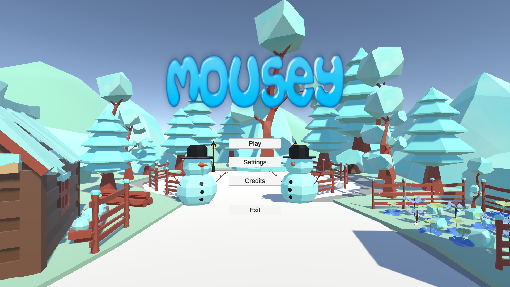
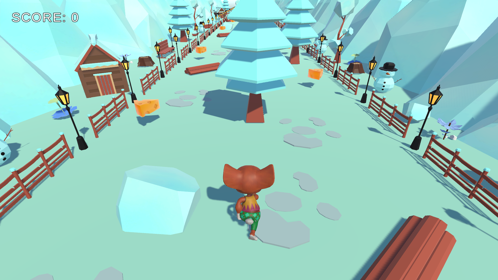

  

# Mousey

A fun and engaging mouse-themed game built with Unity, developed as a final project for the university course on game development in Unity.

## About The Game

Mousey is an endless runner game where players control a mouse character navigating through automatically generated challenges and puzzles. With procedurally generated levels that ensure a unique experience every time, the game features various collectibles and traps that provide an entertaining gaming experience. The immersive gameplay is enhanced by an engaging soundtrack that adapts to the intensity of each run.

## Features

- Auto-generated levels (Endless Runner)
- Intuitive controls
- Traps and collectibles
- Settings customization
- Soundtrack that adapts to the intensity of each run

## Gameplay

## How to Play

1. Start the game and navigate through the main menu
2. Use arrow keys or WASD to control the mouse
3. Collect cheese and avoid traps

## Credits

- **Game Design & Development**: Adam Borowski
- **Environment Assets**:
    - Lowpoly Environment Extreme Pack by *Gee Zyy Games*
    - FREE Casual Food Pack - Mobile/VR by *Lumo-Art 3D*
- **Character Model**: Mousey by *Adobe*, mixamo.com
- **Animation Set**: Animation bundle by *Adobe*, mixamo.com
- **Sound Effects**:
    - FREE Ambient Instrumental Music by *Will Elfer*
    - FREE Casual Game SFX Pack by *Dustyroom*
- **Game Title**: Cool text by *cooltext.com*

## Screenshots

